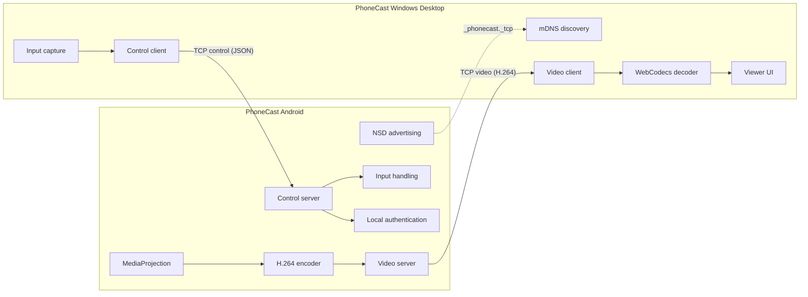
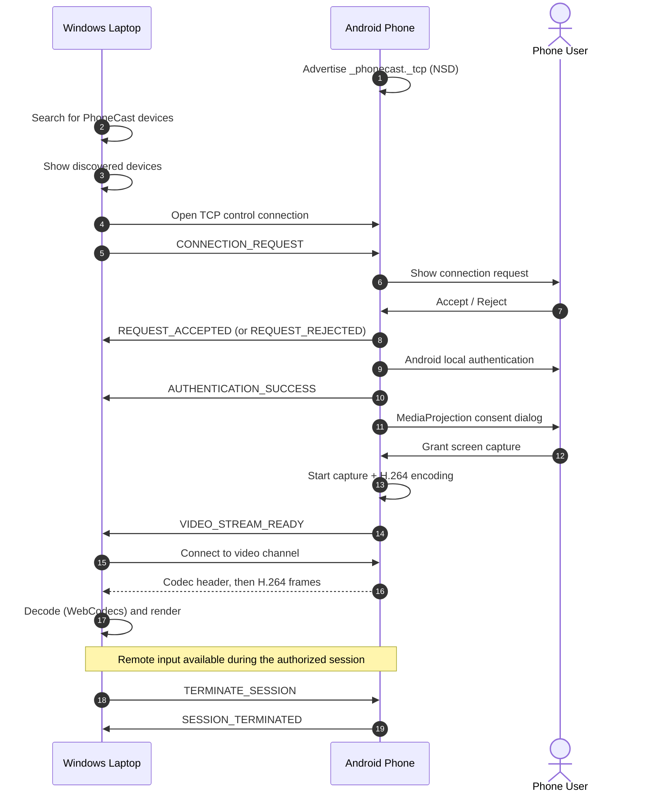

# PhoneCast

**Wireless Android Screen Sharing & Remote Control over Local Network**

PhoneCast is a custom, LAN-based system that mirrors an Android phone's screen onto a Windows laptop and lets the laptop interact with the phone. It is not a single app. It is a **two-application communication system**: an Android app that advertises itself, asks for consent, captures and encodes the screen, and a Windows desktop app (Electron) that discovers the phone, initiates the connection, decodes the video, and sends input back.

There is no cloud service, account server, or relay in between. Devices talk directly over the local network, and nothing starts without explicit approval on the phone.

**What makes the architecture interesting**

- The **laptop always initiates** the connection; the phone only advertises availability.
- Control and video travel on **separate TCP channels** (small JSON messages vs. a continuous H.264 binary stream).
- Access is gated by **multiple consent stages** on the phone, none of which PhoneCast tries to bypass.
- Video is captured with `MediaProjection`, encoded with the hardware H.264 encoder, and decoded on Windows with **WebCodecs**.

> Status note: see [Current Status](#current-status) for what is working vs. in progress vs. planned. Nothing in this README should be read as a performance or compatibility guarantee.

---

## Table of Contents

- [Screenshots](#screenshots)
- [Key Features](#key-features)
- [Two-Application Architecture](#two-application-architecture)
- [Who Initiates, and What Flows Where](#who-initiates-and-what-flows-where)
- [Device Discovery](#device-discovery)
- [Connection Flow](#connection-flow)
- [Authorization and Security Model](#authorization-and-security-model)
- [Media Capture Pipeline](#media-capture-pipeline)
- [Protocol Overview](#protocol-overview)
- [Remote Input](#remote-input)
- [Technology Stack](#technology-stack)
- [Project Structure](#project-structure)
- [User Journeys](#user-journeys)
- [Design System](#design-system)
- [Setup](#setup)
- [Building](#building)
- [Network Requirements](#network-requirements)
- [Troubleshooting](#troubleshooting)
- [Security Considerations](#security-considerations)
- [Limitations](#limitations)
- [Performance](#performance)
- [Current Status](#current-status)
- [Roadmap](#roadmap)
- [Development Philosophy](#development-philosophy)
- [Debugging Architecture](#debugging-architecture)
- [Contributing](#contributing)
- [Repository Hygiene](#repository-hygiene)
- [License](#license)
- [Author](#author)

---

## Screenshots

Add screenshots here.

| Android | Windows |
|---|---|
| _Welcome screen_ | _Desktop dashboard_ |
| _Home dashboard_ | _Device discovery_ |
| _Connection request_ | _Live casting screen_ |

<!-- Suggested placeholder paths once you add images (these files do not exist yet):
docs/screenshots/android-welcome.png
docs/screenshots/android-home.png
docs/screenshots/android-request.png
docs/screenshots/windows-dashboard.png
docs/screenshots/windows-casting.png
-->

---

## Key Features

### Android app

- Onboarding flow
- Local account setup (data stays on the device)
- Local device security authentication through Android system authentication
- Service advertising via Android NSD (mDNS)
- Handling of incoming connection requests with explicit accept / reject
- `MediaProjection` consent
- Screen capture through a foreground `ScreenCaptureService`
- H.264 hardware encoding via `MediaCodec`
- Built-in video TCP server
- Connection history

### Windows app

- Electron desktop application
- LAN device discovery with mDNS / Bonjour (`bonjour-service`)
- Device list and selection
- Connection initiation over a TCP control channel
- Separate TCP video stream connection
- H.264 decoding with WebCodecs `VideoDecoder`
- Live casting interface rendering to a canvas
- Phone interaction via touchpad-style input, keyboard, and supported shortcuts (see [Current Status](#current-status) for the exact state)
- Session termination

---

## Two-Application Architecture

PhoneCast consists of **PhoneCast Android** and **PhoneCast Windows Desktop**. Each has distinct responsibilities.



Simplified view:

```
Android Phone
     │
     │ NSD / mDNS  (advertises _phonecast._tcp)
     ▼
Local Wi-Fi / LAN
     ▲
     │
Windows Laptop
     │
     ├── TCP Control Channel  (JSON messages)
     └── TCP Video Channel    (H.264 binary stream)
```

### Android responsibilities

- Advertising the device on the LAN
- Receiving and presenting connection requests
- Authorization and local authentication
- `MediaProjection` and screen capture
- Video encoding and serving
- Applying received input
- Session management

### Windows responsibilities

- Discovering PhoneCast devices
- Initiating connections
- Control communication
- Receiving the video stream and decoding H.264
- Rendering the phone screen in the UI
- Capturing laptop input and sending remote-control commands
- Session management

---

## Who Initiates, and What Flows Where

**The laptop always initiates the connection. The phone never initiates one.** The phone only advertises that it is available.

```
Laptop discovers phone
        ↓
Laptop connects to phone
        ↓
Laptop sends CONNECTION_REQUEST
        ↓
Phone asks the user for approval
```

> **One-sided initiation does not mean one-way communication.** Once a session is authorized, data flows in both directions.

| Direction | Content |
|---|---|
| **Phone → Laptop** | Screen stream, connection responses, status events |
| **Laptop → Phone** | Connection request, touch/input commands, keyboard commands, shortcut commands, termination commands |

---

## Device Discovery

Discovery and connection are **separate stages**. Discovery only tells the laptop that a phone exists and where to reach it. It does not open a session.

| Side | Library | Detail |
|---|---|---|
| Android | Android NSD | Advertises service type `_phonecast._tcp` |
| Windows | `bonjour-service` | Searches with `type: 'phonecast'`, `protocol: 'tcp'` |

The library prepends the underscore, so the desktop query `phonecast` / `tcp` maps to the advertised `_phonecast._tcp`.

Discovery results provide information such as device name, host/IP, control port, and other service information. After that, the user picks a device and the connection flow begins.

---

## Connection Flow



Step by step:

1. Launch PhoneCast on Android.
2. Launch PhoneCast on Windows.
3. Connect both devices to the same LAN.
4. Android advertises the PhoneCast service.
5. Windows searches for PhoneCast devices.
6. Windows shows the discovered devices.
7. The user selects a phone.
8. The laptop opens a TCP control connection.
9. The laptop sends `CONNECTION_REQUEST`.
10. The phone displays the request.
11. The user accepts or rejects.
12. If accepted, Android performs local authentication.
13. Android requests `MediaProjection` consent.
14. The user grants screen capture permission.
15. Android starts screen capture.
16. Android starts H.264 streaming.
17. The phone sends `VIDEO_STREAM_READY`.
18. The laptop connects to the video stream.
19. The laptop decodes H.264.
20. The laptop renders the phone screen.
21. Remote input becomes available.
22. The user can terminate the session.

### Five states that are not the same thing

These are distinct milestones. Being at one does not imply the next:

| # | State | Meaning |
|---|---|---|
| 1 | TCP connection established | A socket is open. Nothing has been requested yet. |
| 2 | Request delivered | The phone received `CONNECTION_REQUEST`. |
| 3 | Request accepted | The user approved on the phone. |
| 4 | Authentication successful | Android local authentication passed. |
| 5 | Screen sharing started | `MediaProjection` was granted and the stream is live. |

---

## Authorization and Security Model

PhoneCast uses several user-consent stages, all on the phone:

1. **The laptop initiates** a request.
2. **The phone explicitly accepts** it.
3. **Android local authentication** is completed.
4. **Android `MediaProjection` consent** is granted.

PhoneCast does **not** attempt to bypass biometrics, PIN, pattern, password, or Android's screen-capture consent.

Remote input is only allowed during an authorized session. When the session ends:

- remote input stops,
- sockets close,
- session state is cleared.

See also [Security Considerations](#security-considerations) for what is not claimed.

---

## Media Capture Pipeline

```
Android Display
      ↓
MediaProjection
      ↓
ScreenCaptureService
      ↓
H.264 Hardware Encoder (MediaCodec)
      ↓
Video TCP Server
      ↓
LAN
      ↓
Windows Electron Main Process
      ↓
IPC
      ↓
Renderer
      ↓
WebCodecs VideoDecoder
      ↓
Canvas / Live Viewer
```

### Why two channels?

| Channel | Content | Characteristics |
|---|---|---|
| **Control** | Application events and commands | Low bandwidth, newline-delimited JSON |
| **Video** | H.264 stream | Continuous binary data |

Keeping them separate means a burst of video data does not delay a control message such as a rejection or a termination, and each channel can use a format suited to its content.

No specific FPS or latency is guaranteed. See [Performance](#performance).

---

## Protocol Overview

### Control protocol

Control messages are **JSON followed by a newline** (newline-delimited JSON) over the TCP control channel. These are application-level events, not transport events.

Message types:

| Message | Purpose |
|---|---|
| `CONNECTION_REQUEST` | Laptop asks the phone for a session |
| `REQUEST_ACCEPTED` | User accepted on the phone |
| `REQUEST_REJECTED` | User rejected on the phone |
| `AUTHENTICATION_REQUIRED` | Phone needs local authentication |
| `AUTHENTICATION_SUCCESS` | Local authentication passed |
| `SCREEN_CAPTURE_STARTED` | Capture has started |
| `SCREEN_CAPTURE_READY` | Capture is ready |
| `SCREEN_SHARE_READY` | Screen sharing is ready |
| `SCREEN_CAPTURE_FAILED` | Capture could not start |
| `VIDEO_STREAM_READY` | Video server is ready for the laptop to connect |
| `VIDEO_STREAM_STOPPED` | Video stream ended |
| `TERMINATE_SESSION` | Laptop asks to end the session |
| `SESSION_TERMINATED` | Session has ended |

<!-- Confirm this list against the source. Remove or add types to match what is actually in the code. -->

> Payload field names for each message are not documented here. Add them once the schema is finalized.

### Video protocol

Each packet on the video channel has this layout:

```
┌──────────────────┬──────────────────┬─────────────┐
│ 4 bytes          │ 4 bytes          │ payload     │
│ packet type      │ payload size     │ (N bytes)   │
└──────────────────┴──────────────────┴─────────────┘
```

| Packet type | Meaning |
|---|---|
| `1` | Codec header |
| `2` | H.264 frame |

**Codec header payload**

| Field | Description |
|---|---|
| `protocolVersion` | Video protocol version |
| `width` | Video width |
| `height` | Video height |
| `frameRate` | Frame rate |
| `bitrate` | Bitrate |
| `csd0Length` | Length of CSD0 |
| `csd0` | CSD0, the **SPS** |
| `csd1Length` | Length of CSD1 |
| `csd1` | CSD1, the **PPS** |

**Frame payload**

| Field | Description |
|---|---|
| `presentationTimeUs` | Presentation timestamp in microseconds |
| `flags` | Frame flags |
| H.264 frame data | Encoded frame bytes |

<!-- Endianness and exact field widths are not specified here. Add them from the source if you want this section to be a full spec. -->

---

## Remote Input

The goal is to let laptop input operate the real Android interface:

```
Laptop input
      ↓
PhoneCast control layer
      ↓
LAN
      ↓
Android input handling
      ↓
Real Android interface
```

Input commands travel over the control channel and are only accepted during an authorized session.

### Touch / pointer

Categories: tap, press, drag, move, release. Scrolling and multi-touch are noted as **only if implemented**; see [Current Status](#current-status).

**Coordinate mapping.** The viewer on the laptop and the video from the phone have different dimensions:

| Laptop viewer | Phone video |
|---|---|
| `viewerWidth` × `viewerHeight` | `phoneWidth` × `phoneHeight` |

Converting a pointer position on the viewer into a position on the phone has to account for:

- aspect ratio
- scaling
- letterboxing
- fullscreen
- device rotation
- DPI / CSS pixels

### Keyboard

Event kinds: key down, key up, text input where supported, special keys, and modifiers. Examples: `ENTER`, `BACKSPACE`, `DELETE`, `TAB`, `ESC`, `SPACE`, arrow keys.

Full keyboard support is **not** claimed. See [Current Status](#current-status).

### Shortcuts

Shortcuts fall into two groups:

- **PhoneCast-controlled shortcuts**, which the app may handle itself.
- **Windows-owned shortcuts**, which belong to the operating system.

PhoneCast should not indiscriminately intercept protected Windows system shortcuts.

---

## Technology Stack

### Android

| Technology | Purpose |
|---|---|
| Kotlin | Android application language |
| Android NSD | LAN service advertising |
| `MediaProjection` | Screen capture |
| `MediaCodec` | H.264 hardware encoding |
| Android system authentication | Local authorization |
| Local storage (e.g. SQLite) | Local account and history data |
| Accessibility service or other supported API | Applying remote input |

<!-- Verify each row. Keep only technologies that are actually used. In particular confirm the storage mechanism and the input mechanism. -->

### Windows

| Technology | Purpose |
|---|---|
| Electron | Desktop application shell |
| Node.js | Desktop backend / runtime |
| `bonjour-service` | mDNS discovery |
| Node `net` module | TCP control and video networking |
| WebCodecs | H.264 decoding |
| HTML / CSS / JavaScript | User interface |
| `contextBridge` | Secure IPC bridge between main and renderer |

---

## Project Structure

> The tree below is the **intended layout**. Update it to match the repository exactly. Do not list folders that do not exist yet.

```
PhoneCast/
│
├── app/                      # Android source
│
├── desktop/
│   ├── electron/
│   │   ├── main.js
│   │   └── preload.js
│   │
│   ├── renderer/
│   │   ├── index.html
│   │   ├── style.css
│   │   ├── renderer.js
│   │   ├── state/
│   │   ├── core/
│   │   ├── pages/
│   │   ├── connection/
│   │   ├── video/
│   │   ├── input/            # only if present in the repo
│   │   └── ui/
│   │
│   ├── assets/
│   ├── package.json
│   └── package-lock.json
│
├── .gitignore
└── README.md
```

---

## User Journeys

### Android

**Welcome.** PhoneCast logo, a wireless screen-sharing message, hero artwork, a short introduction, and a continue action.

**Account setup.** Enter a name to create a local account, with an explanation that the data stays on the device.

**Security.** Device security step with fingerprint/biometric artwork, backed by Android system authentication.

**Home.** Greeting, "Ready" status, quick actions, connection requests, connection history, and an empty state when there are no requests.

**Connection request.** The user-facing flow:

```
Laptop requests
       ↓
Phone popup
       ↓
Accept / Reject
       ↓
Authentication
       ↓
MediaProjection
       ↓
Casting
```

### Windows

Include the following **where implemented**:

- Welcome page
- Account / name flow
- Password / setup flow
- Home dashboard
- Search devices
- Discovered devices list
- Connection status
- Connection history
- Settings
- Casting page with live phone viewer
- Remote input controls
- Disconnect action

<!-- Delete any item above that does not exist in the app yet. -->

---

## Design System

PhoneCast's visual direction is **futuristic, dark, minimal, technical, and premium**.

- Dark charcoal backgrounds
- Grey cards with rounded corners
- Neon / electric blue accents with a subtle glow
- High contrast and clean spacing

---

## Setup

### Android development

Requirements:

- Android Studio
- Android SDK (installed through Android Studio)
- An Android device (USB debugging enabled) or an emulator
- JDK / Gradle versions as required by the project's Gradle configuration (add exact versions once confirmed)

Steps:

1. Clone the repository.
2. In Android Studio choose **Open** and select the Android project folder (`app/` lives inside it).
3. Let Gradle sync finish.
4. Select a device and click **Run**.

For discovery to work, the phone must be on the same network as the laptop. Emulators usually sit behind their own virtual network and may not be discoverable from the laptop, so a physical device is the safer choice.

### Windows development

Requirements:

- Node.js and npm

```bash
cd desktop
npm install
npm start
```

<!-- Confirm that `npm start` matches the "scripts" in desktop/package.json. -->

---

## Building

### Android APK

In Android Studio:

**Build → Build APK(s)**

- **Debug APK:** for development and testing. Signed with a debug key.
- **Release APK:** for distribution. It must be signed with your own key.

Never commit keystores, passwords, or signing configuration containing secrets.

### Windows app

Production packaging is **not documented yet**. If the project is set up with `electron-builder`, add the actual build script and output location here, for example:

```bash
cd desktop
npm run <your-build-script>
```

Do not describe an installer as available until packaging is configured and tested.

---

## Network Requirements

- The phone and the laptop should normally be on the **same local network**.
- Discovery and direct communication depend on LAN conditions.
- Possible blockers:
  - guest Wi-Fi isolation
  - router / access point client isolation
  - Windows firewall rules and network profile (Public vs. Private)
  - unreachable control or video ports

PhoneCast makes no guarantee that any given network will allow discovery or direct connections.

---

## Troubleshooting

**Phone is not discovered**

- Confirm both devices are on the same Wi-Fi.
- Confirm the phone is advertising the service (the app is open and ready).
- Check for guest-network or client isolation.
- Restart discovery on the laptop.
- Check Windows firewall settings.

**Phone appears but the connection fails**

- Verify the IP address shown for the phone.
- Verify the control port.
- Inspect the TCP error in the desktop app's logs.
- Check Windows firewall rules.

**Connected, but the screen does not appear**

- Check whether `MediaProjection` permission was granted.
- Check whether `VIDEO_STREAM_READY` was sent.
- Verify the video port is reachable.
- Inspect H.264 / encoder logs on Android.
- Inspect decoder errors from WebCodecs on the desktop.

**Touch or keyboard does not work**

- Verify remote input is enabled and the session is authorized.
- Inspect whether input events are being sent from the desktop.
- Inspect the Android input mechanism (for example, whether the required service is enabled).

---

## Security Considerations

- **LAN-local design.** Communication is between the two devices on the local network. There is no PhoneCast cloud service.
- **Explicit request and approval.** Sessions begin only after the user accepts on the phone.
- **Android authentication and `MediaProjection` consent.** Both are required and handled by Android.
- **Remote input is limited to authorized sessions.**

Security boundaries depend on Android, Windows, network configuration, and implementation details.

**Transparency note:** unless TLS or other transport encryption is implemented and documented here, **do not assume network traffic is encrypted**. Anyone able to observe traffic on the same network may be able to see it. Use PhoneCast on networks you trust. If encryption is added later, document it in this section.

---

## Limitations

- Phone and laptop must be able to reach each other over the LAN.
- Network isolation or firewall rules can prevent discovery or connection.
- Android permission requirements apply (`MediaProjection`, local authentication, and whatever the input mechanism requires).
- Encoder performance varies by device.
- WebCodecs availability and H.264 decoding support depend on the Electron / Chromium version and the system.
- Android restricts how remote input can be injected, and behavior may differ across Android versions.
- Achievable resolution and frame rate are hardware dependent.

---

## Performance

PhoneCast is designed to target low-latency, high-quality streaming, subject to device and network capabilities.

The design choices that serve that goal:

- hardware H.264 encoding on the phone
- preferred hardware-accelerated decoding on the laptop
- separate control and video channels
- efficient binary transport for video

No FPS, resolution, or latency figures are promised. If you measure them, add the results here together with the test setup (devices, Wi-Fi band, resolution, bitrate).

---

## Current Status

> Review this section before publishing. Move items between columns so it reflects what you have actually verified.

### ✅ Implemented / working

- Android onboarding, local account, and system authentication
- NSD advertising on Android and mDNS discovery on Windows
- Laptop-initiated `CONNECTION_REQUEST` with phone-side accept / reject
- `MediaProjection` consent and screen capture
- H.264 hardware encoding and video TCP server
- Separate control and video channels with the packet formats above
- H.264 decoding with WebCodecs and live canvas rendering
- Session termination

### 🚧 In progress

- Remote touch input (coordinate mapping, gesture coverage)
- Keyboard input and special keys
- Shortcut handling

### 🔮 Planned

See the [Roadmap](#roadmap).

---

## Roadmap

These are **future ideas**, not existing features.

**Core**
- Improved reconnect behavior
- Session reliability

**Remote control**
- Richer touch gestures and multi-touch
- Keyboard improvements
- Shortcut customization

**Performance**
- Exploration of UDP / lower-latency video transport
- Adaptive bitrate
- FPS controls
- Latency telemetry

**Utility**
- Clipboard synchronization
- File transfer
- Screenshots
- Drag and drop
- Recording

**UX**
- Settings
- Device trust and remembered devices
- Polished installer
- Improved onboarding

---

## Development Philosophy

Development is incremental:

```
Build one subsystem → test → fix errors → verify → continue
```

PhoneCast combines networking, Android system permissions, video streaming, desktop rendering, and remote input. Changing several unrelated subsystems at once makes failures hard to localize, so changes are kept small and verified one layer at a time.

---

## Debugging Architecture

When something fails, work down this list. Each question isolates one layer.

| Layer | Question |
|---|---|
| Discovery | Can the laptop find the phone? |
| TCP | Can the laptop connect? |
| Control | Was `CONNECTION_REQUEST` sent? |
| Authorization | Did the phone accept? |
| Authentication | Did local Android authentication succeed? |
| Capture | Did `MediaProjection` start? |
| Video | Did the H.264 stream start? |
| Decode | Did WebCodecs decode frames? |
| Render | Did a frame appear on the canvas? |
| Input | Did the phone receive touch / keyboard input? |

---

## Contributing

1. Fork or clone the repository.
2. Create a branch for your change.
3. Get familiar with both the Android and the desktop side.
4. Make focused changes.
5. Test both sides where applicable.
6. Document any protocol changes in this README.
7. Open a pull request.

---

## Repository Hygiene

Do not commit generated, dependency, or secret files, for example:

```
node_modules/
build/
.gradle/
local.properties
*.jks / *.keystore
private secrets
```

Never upload release keystores or signing credentials.

---

## Author

**Yash Takalkar**

- GitHub: [Yash-0608](https://github.com/Yash-0608)
- LinkedIn: [yash-takalkar](https://linkedin.com/in/yash-takalkar-5a364a284)
- Portfolio: [portfolio-website-one-xi-92.vercel.app](https://portfolio-website-one-xi-92.vercel.app)
